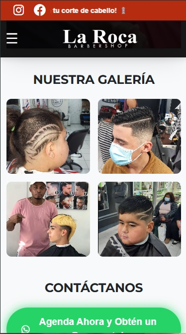
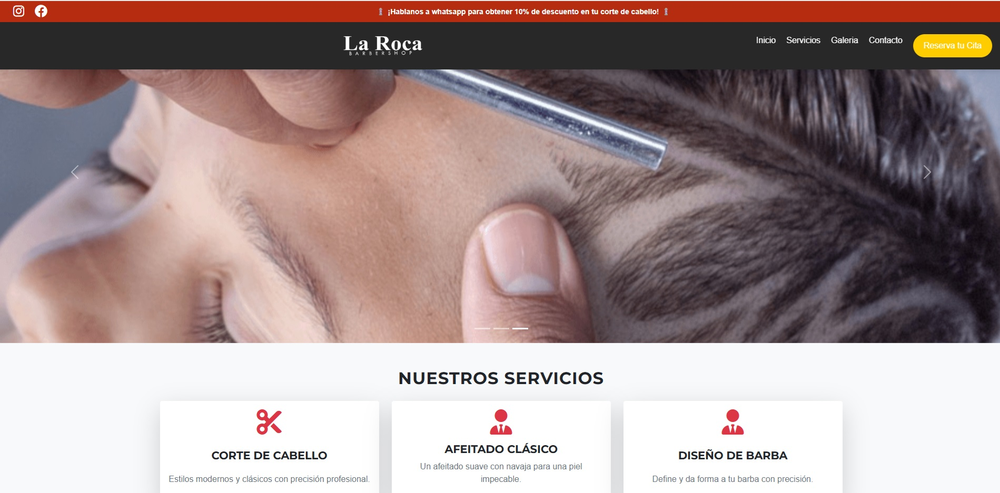

# 💈 La Roca Barber Shop - Landing Page Profesional

🚀 **Landing page optimizada para La Roca Barber Shop**, diseñada para atraer más clientes y mejorar la conversión de reservas a través de WhatsApp.

 
 
---

## 🎯 **Características Principales**
✅ **Diseño Profesional y Responsivo** con Bootstrap 5.  
✅ **Optimización SEO** para mejorar el posicionamiento en Google.  
✅ **Botón de WhatsApp flotante** para facilitar reservas.  
✅ **Testimonios de clientes** para generar confianza.  
✅ **Galería de imágenes profesional** para mostrar los cortes de cabello.  
✅ **Mapa de Google Maps** para facilitar la ubicación.  
✅ **Navbar con botón de reserva** para CTA inmediato.  
✅ **Oferta con cuenta regresiva** para incentivar la acción rápida.  
✅ **Integración con redes sociales** (Facebook, Instagram y WhatsApp).  

---

## 🛠 **Tecnologías Utilizadas**
- **HTML5 & CSS3** → Para la estructura y estilos.  
- **Bootstrap 5** → Para diseño responsivo y componentes modernos.  
- **JavaScript (Vanilla JS)** → Para interactividad y cuenta regresiva.  
- **SEO On-Page** → Metaetiquetas optimizadas para mejorar visibilidad en Google.  
- **Google Maps API** → Para mostrar la ubicación exacta de la barbería.  
- **FontAwesome** → Para iconos atractivos.  

---

## 🔍 **Optimización SEO**
- 📌 **Metaetiquetas y Open Graph:** Configuradas para Google y redes sociales.  
- 🔑 **Palabras clave relevantes:** "Barbería en Melipilla", "corte de cabello", "barbería profesional", etc.  
- 📲 **Botón de WhatsApp optimizado:** Para conversión rápida.  
- 🖼 **Carga diferida (`loading="lazy"`) en imágenes:** Para mejor rendimiento.  

---

## 📲 **Cómo Ver la Página**
Puedes ver el sitio en vivo aquí: **[https://larocabshop.netlify.app](https://larocabshop.netlify.app)** *(Reemplaza con el link real)*  

---

## 📥 **Cómo Clonar y Usar**
Si deseas probar el código en tu propio entorno local, sigue estos pasos:

```bash
# Clona este repositorio
git clone https://github.com/tuusuario/laroca-barbershop.git

# Entra en la carpeta del proyecto
cd laroca-barbershop

# Abre el archivo index.html en tu navegador


